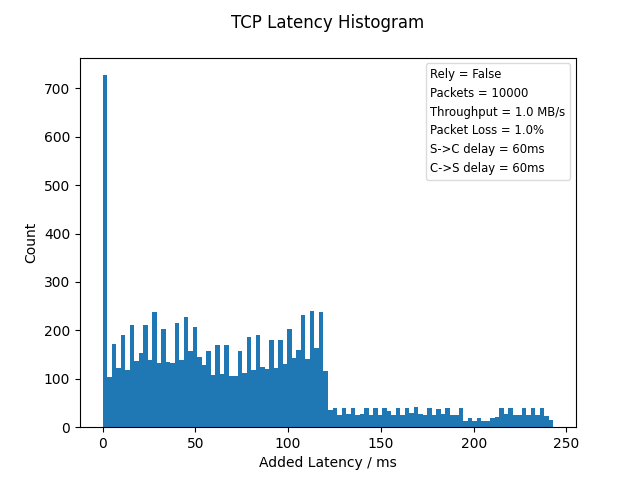
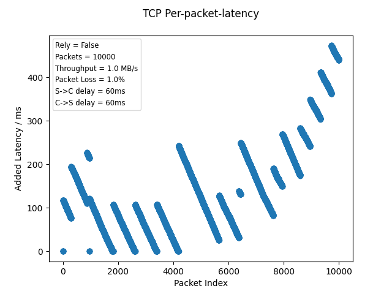

====================
TCP Testing (Linux)
====================

This repo is Steinwurf's public TCP-testing python3 program, used to showcase the power of Forward Erasure Correction (FEC) - more specifically our library Rely - utilized under a TCP stream.
It runs a test that measures the latency added to each packet and returns plots to visualize this metric.

Reasoning
---------

When TCP experiences a packet loss, it will attempt to retransmit the packet and block other packets from being sent until an acknowledgement (ACK) is received.
This behaviour will add latency to not only the initially lost packet, but also the succesive packets until the protocol catches up.

To test our FEC-library Rely, we wanted to set up a demo, where Rely is setup in a layer underneath the TCP in an attempt to fix the packet losses before TCP would otherwise act on them, and thus stop the connection from going out of hand.

The TCP-mechanism described above is called `Nagle's Algorithm <https://en.wikipedia.org/wiki/Nagle%27s_algorithm>`_ and the reasoning for the blocking of successive packets is, that the packet loss is suspected to be due to congestion.

Since this setup uses a Pseudo-random-number-generator (PRNG) for the packet losses and does not congest the channel, we have decided to turn Nagle's algorithm off in the TCP Stream.

Technicalities
--------------

The script creates two network namespaces 'client' and 'server' and sets up two veths between them, adds delay and packet loss between them
using the Linux "ip" command (requires Super-User privileges and thus password).

The server and client scripts are then run in separate terminals from each of their namespaces, and two TCP sockets are set up in Python3. The server then sends packets to the client
and delay or throughput is measured on the client side.

If the selected mode is histogram, the script returns a added-latency-histogram plot and a packet-index vs added-latency plot after each test-case, e.g:

If this is run on a linux machine where the super-user command is not 'sudo' this must be altered in main.py and setup.py to the approriate setup.

Remember, that there is randomness involved, so don't be surprised if e.g 1.5% packet loss shows better results than 1.0% packet loss.
For more consistency in the results, you can increase the amount of packets transfered (default is 10000) by using the "--packets 'value'" options.

NOTE: Throughput mode is currently not working as intented.

Usage
-----

To run the default setup use the following commands from the root of the tcp-test directory::

    python3 waf run

The waf script takes several arguments which can be seen by calling the waf help::

    python3 waf -h

The arguments are found in the "Options" section starting with "--mode".

There are other fixed parameters like Rely's repair interval and target, as well as the packet losses to test at. These can be found in the top part of main.py

With Rely
---------

If you wish to run a Rely tunnel underneath the TCP connection, you must have cloned and built the rely-app::

    git clone git@github.com:steinwurf/rely-app.git
    cd rely-app
    python3 waf configure
    python3 waf

In the tcp-test root, you can then provide the path to the rely-app binary from the command-line::

    cd path/to/tcp-test
    python3 waf run --rely-path path/to/rely-app/build/linux/app/rely

