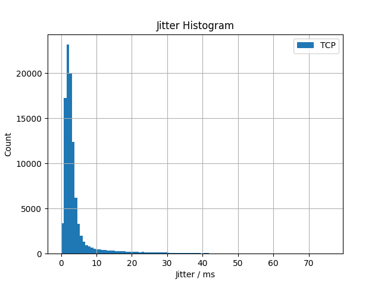
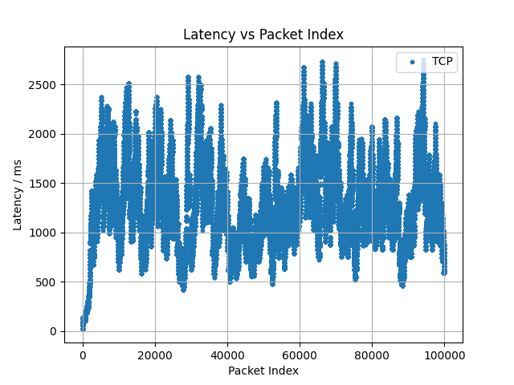

====================
TCP Testing (Linux)
====================

This repo is Steinwurf's public TCP-testing python3 program, used to showcase
the power of Forward Erasure Correction (FEC) - more specifically our library
Rely - utilized under a TCP stream.

It runs a test that measures the jitter and latency in the connection and can
return plots to visualize this metric.

Reasoning
=========

When TCP experiences a packet loss, it will attempt to retransmit the packet and
block other packets from being sent until an acknowledgement (ACK) is received.
This is to ensure that the bytestream is received in order.
This behaviour will add latency to not only the initially lost packet, but also
the succesive packets until the protocol catches up.

To test our FEC-library Rely, we wanted to set up a demo, where Rely is setup in
a layer underneath the TCP in an attempt to fix the packet losses before TCP
would otherwise act on them, and thus stop the connection from going out of hand.

The TCP also has a mechanism that holds back packets until it has a sufficient
amount of data to send. This algorithm is called `Nagle's Algorithm
<https://en.wikipedia.org/wiki/Nagle%27s_algorithm>`_ .
Nagle's algorithm would add further unnecessary latency if the throughput of the
stream is low. Therefore we have decided to turn Nagle's algorithm off in the
TCP Stream. The algorithm could become optional in future versions.

For further details about TCP see the `Wikipedia Page
<https://en.wikipedia.org/wiki/Transmission_Control_Protocol>`_

Technicalities
==============

The scripts main components are the client / server pair (client.py,
server.py), the network namespace test (network.py) and the plotting function
(plot.py)

Standalone client/server test
-----------------------------
The client / server pair can be run on two different machines, where jitter can
be recorded. If there is clock synchronization between the machines, latency can
also be recorded. The client and server scripts sets up two TCP sockets in
Python3 with the TCP_NODELAY socket option (Turn of Nagle's algorithm). The
server then timestamps, indexes and sends packets to the client
and jitter (and latency if clocks are in sync) is measured on the client side,
and dumped to a json file. The location of the dump can be parsed with the
--result_path option to client.py

Network namespace test
----------------------
The network namespace test runs locally on the same machine. It creates two
network namespaces 'demo0' and 'demo1', sets up two veths between them, and adds
delay and packet loss between them using the Linux "ip" command (requires
Super-User privileges and thus password).

The server and client scripts are then run in separate terminals from each of
these namespaces and works like the standalone scripts.

Rely Tunnel
-----------
If you have access to the Rely-app and want to run the client/server setup through
Rely-tunnels on two machines, you can set up two tunnels in each direction
(ip1 -> ip2, ip2 -> ip1) and parse the tunnel ip-addresses to the client and
server scripts from the command line.

If you want to run the network namespace setup through Rely-tunnels you can
parse the path the the rely-app binary to network.py with the --rely_path option
and the Rely setup is done automatically.

Plotting
--------
To plot your results you simply parse the path to the resulting json file with
the --json_path option and parse the location to dump the plots with the
--plot_path option.

The script will then generate a histogram, a scatter plot and a line plot for
the jitter results (and latency results if any).

They will look like so:

Options
=======
The different options for the commands can be shown with the --help command::

    python3 network.py --help
    python3 client.py --help
    python3 server.py --help
    python3 plot.py --help

All options have defaults. The client and server scripts are run on local-host
(127.0.0.1) by default.

Getting the Rely app
====================
NOTE: For this part, you need access to the rely-app repository through a
license.

If you wish to run a Rely tunnel underneath the TCP connection, you must have
cloned and built the rely-app::

    git clone git@github.com:steinwurf/rely-app.git
    cd rely-app
    python3 waf configure
    python3 waf

In the tcp-test root, you can then provide the path to the rely-app binary from
the command-line::

    cd path/to/tcp-test
    python3 waf run --rely-path path/to/rely-app/build/linux/app/rely

